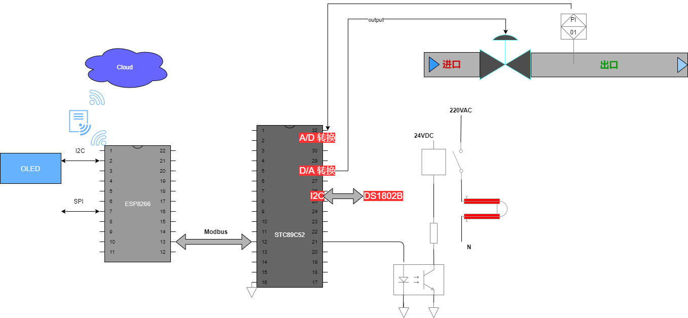

png)png)png)png)
[Toc]
# 开发目的
 近年来，物联网（**_IoT_:Internet Of Things**）产业蓬勃发展，产品快速迭代、百花齐放，市场持续拓展、规模升级。我们看到阿里、小米等巨头全面发力，越来越多的企业将IoT作为新方向，越来越多的投资机构开始布局，IoT逐步由技术革新走向行业场景落地。政策助推、场景涌现、资本蜂拥、巨头入场，产业赛道日益清晰，产新君带你近距离感受IoT的巨大魅力。

物联网是实现“万物互联、万物智联”的基石。根据国际电信联盟（ITU）的定义，物联网是指通过二维码识读装置、射频识别装置、红外感应装置、全球定位系统和激光扫描器等传感设备，按照约定的协议，将物品与互联网相连，进行信息交换传输, 实现智能化识别、定位、交互、监控和管理的网络。

物联网也是实现智能化社会的必要途经。超大规模的数字连接可助力传统行业实现数字化转型，显著提升各行各业的生产运营效率，带来生产力的巨大提升，赋能经济与社会，推动智能革命。

> email: motion_tek@163.com
> Password: 
> GitHub:https://github.com/motiontek/Project.git

## 物联网架构
从开发的角度，**无线接入**是物联网设备端的核心技术，**身份设备管理**和**消息推送技术**是物联网云端的核心技术。
* 架构图
---  

## 物联网协议
物联网除了有关硬件，通讯相关的问题，比如物联网模块，物联网通讯协议*MQTT*、_XMAP_、*NB_IOT* 等，这些只是物联网中一部分，还要涉及到物联网的设备如何管理，用户如何管理，数据包如何解析，大数据如何展示等也是物联网模块中非常重要的部分，所以根据本次设计工作中的要求，构建在云端的物联网平台基本架构为目的，一步一步来开发一套物联网平台。

物联网平台，应该是基于现在的互联网，通讯技术来建构用户可以基于自身的设备技术架构，简单轻松接入物联网。

1. $\underline{基于移动5G/4G通讯}$
2. $\underline{基于wifi局域网}$
3. 基于蓝牙通讯
4. 基于zigbee

# 总体方案

## 整体架构

## 方案说明

### ESP8266 原理
#### ESP8266 介绍
#### Wi-Fi 通讯
### STC 单片机温控
#### 温度采集
#### PID
#### Protues 仿真
### Modubus 通讯
# PC或移动端云方案
## UI 开发
## 数据库开发
## 云部署
